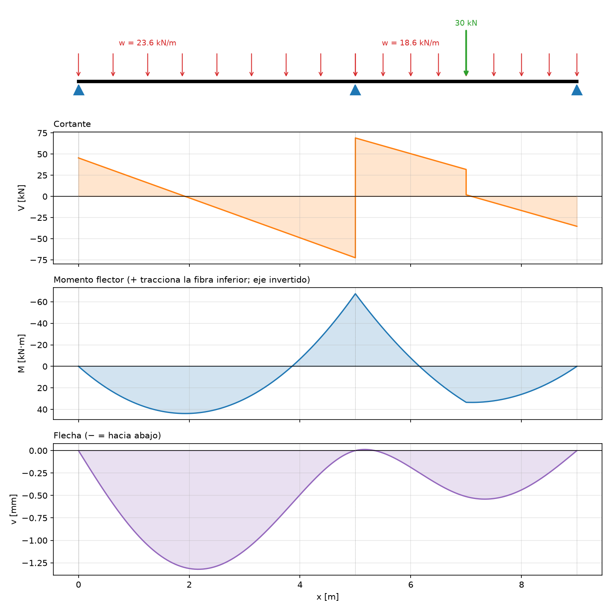

# estates-2.0

Análisis y verificación de **vigas continuas** por el método de rigidez
directa, para ingeniería civil. Calcula reacciones, diagramas de cortante,
momento flector y flecha, y verifica esfuerzos y deflexión admisible.



## Background

El proyecto reutiliza las expresiones matemáticas de `primitives.py` de
[PyMAS](#créditos) (análisis matricial de estructuras) para construir una
herramienta distinta: en lugar de un modelo general de pórticos 3D, un
programa dedicado al análisis de vigas continuas.

| Expresión reutilizada | Dónde está |
|---|---|
| A, Iy, Iz, J de secciones rectangular y circular | `estates/secciones.py` |
| Rigidez a flexión: 12EI/L³, 6EI/L², 4EI/L, 2EI/L | `Tramo.rigidez_local` |
| Acciones de empotramiento: qL/2, qL²/12, Pb²(3a+b)/L³, ... | `Tramo.acciones_empotramiento` |
| Reconstrucción interna con x³/(6EI), x²/(2EI), x⁴/(24EI) | `Tramo.campos` |

Además se agregan cálculos propios de diseño: peso propio (γ·A), esfuerzo por
flexión σ = M·c/Iz, cortante máximo τ = k·V/A y control de flecha admisible.

## Install

Requiere Python 3.9 o superior.

```bash
git clone https://github.com/Awin-nieves/estates-2.0.git
cd estates-2.0
pip install -e ".[dev]"
```

## Usage

```python
from estates import Tramo, VigaContinua, concreto, seccion_rectangular

concreto21 = concreto(21)                          # f'c = 21 MPa
sec = seccion_rectangular("30x50 cm", base=0.30, altura=0.50)

tramo1 = Tramo(L=5.0, material=concreto21, seccion=sec, w=20.0)
tramo2 = Tramo(L=4.0, material=concreto21, seccion=sec, w=15.0,
               puntuales=[(2.0, 30.0)])            # 30 kN a 2 m del nudo 1

viga = VigaContinua([tramo1, tramo2],
                    apoyos=["articulado", "articulado", "articulado"])
viga.resolver()
viga.resumen(limite_flecha=360)                    # reacciones y verificaciones
viga.graficar(archivo="viga_continua.png")         # esquema y diagramas
```

Ejemplos completos: `python examples/dos_tramos.py` y
`python examples/tres_tramos.py` (viga continua de tres tramos, con carga
puntual en el tramo central).

**Apoyos** (uno por nudo): `"empotrado"`, `"articulado"` o `"libre"`.
**Cargas nodales**: `VigaContinua(..., cargas_nodales={nudo: (P, M)})`, con P
hacia abajo [kN] y M antihorario [kN·m].

### Convenciones

- Eje x a lo largo de la viga, eje y hacia arriba, giros positivos
  antihorarios (las mismas de PyMAS).
- M > 0 tracciona la fibra inferior (en el gráfico, el eje de M está
  invertido para dibujar M+ del lado de la tracción).
- Las cargas se ingresan con **hacia abajo positivo**.
- Unidades: kN, m, kPa (= kN/m²). Por ejemplo, para f'c = 21 MPa,
  E = 4700·√21·1000 ≈ 2.15·10⁷ kPa ≈ 21.5 GPa.

## Verificación

```bash
pytest
```

Los 16 tests comparan el programa con soluciones analíticas:

| Caso | Solución comprobada |
|---|---|
| Simplemente apoyada, w uniforme | R = wL/2, M máx = wL²/8, δ = 5wL⁴/(384EI) |
| Voladizo, P en el extremo | δ = PL³/(3EI), M empotramiento = PL |
| Voladizo, w uniforme | δ = wL⁴/(8EI) |
| Dos tramos iguales, w uniforme | R_A = 3wL/8, R_B = 5wL/4, M_B = −wL²/8 |
| Doblemente empotrada, P al centro | M extremos = −PL/8, M centro = PL/8, δ = PL³/(192EI) |
| Simplemente apoyada, P excéntrica | R_A = Pb/L, R_B = Pa/L, M máx = Pab/L |
| Ejemplo de dos tramos | Equilibrio ΣR = ΣP y ecuación de los tres momentos |
| Secciones | A, Iy, Iz y J contra sus fórmulas |
| Entradas inválidas | Mecanismo, carga puntual fuera del tramo, apoyos faltantes |

## Limitaciones

- Comportamiento elástico lineal con sección bruta: no considera fisuración
  del concreto ni rigidez efectiva, que importan en deflexiones reales de
  concreto reforzado.
- Solo flexión y cortante en el plano vertical: sin carga axial ni torsión
  (J se calcula, pero no interviene).
- Ec = 4700·√f'c (NSR-10 C.8.5.1 / ACI 318) y el límite de flecha L/360 son valores
  típicos: verifícalos con la norma y el criterio que corresponda.

## Estructura del repositorio

```
estates-2.0/
├── estates/
│   ├── materiales.py    # Material, concreto()
│   ├── secciones.py     # Seccion, seccion_rectangular(), seccion_circular()
│   ├── vigas.py         # Tramo, VigaContinua
│   └── graficos.py      # esquema y diagramas
├── examples/dos_tramos.py, tres_tramos.py
├── tests/
├── docs/img/
└── pyproject.toml
```

## Contribution

Contributions are welcome. Please open an issue or submit a pull request.

## License

This project is licensed under the MIT License. See [LICENSE](LICENSE).

## Créditos

Las expresiones matemáticas provienen de `primitives.py` de PyMAS, la
biblioteca de análisis matricial de estructuras que sirvió de referencia.
